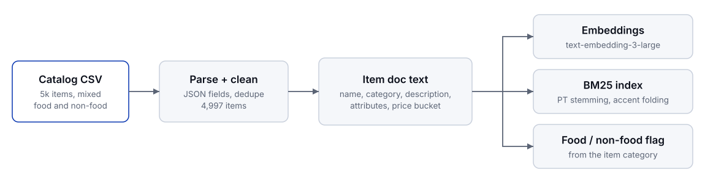
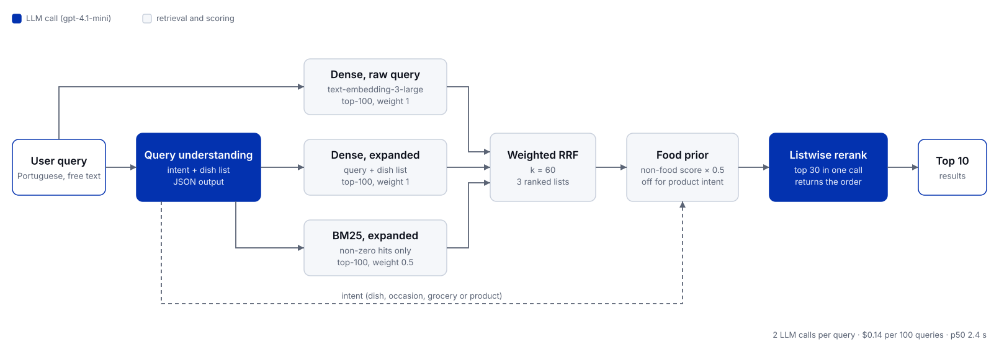
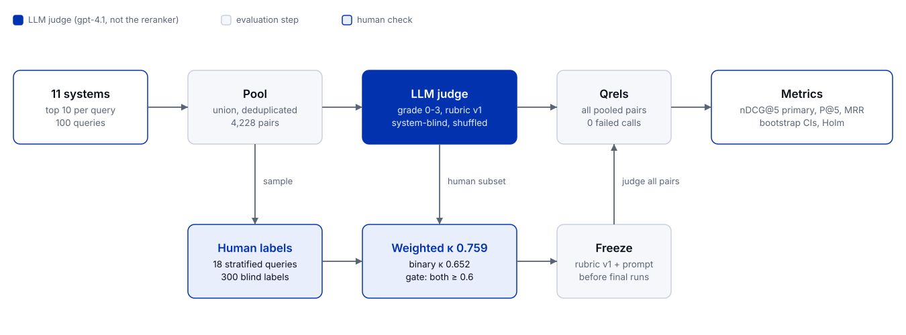
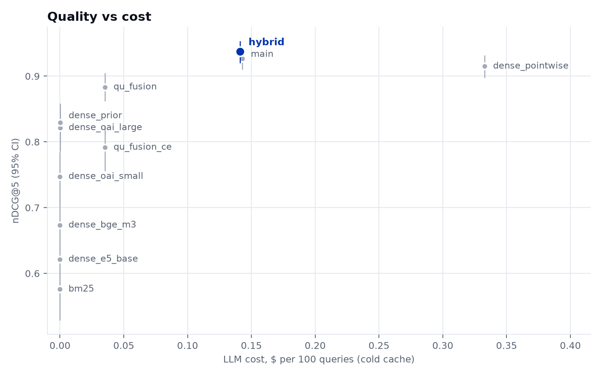

# FoodSearch: semantic search for a Portuguese food-delivery catalog

Semantic search over a mixed ~5k-item delivery catalog (prepared dishes, groceries, drinks, pharmacy, hygiene, pet and home items) for 100 abstract Portuguese search intents, plus an evaluation method that works without ground-truth labels.

The headline system, `hybrid`, reaches **nDCG@5 0.937** [0.920, 0.953] against 0.576 for a BM25 baseline and 0.915 for dense retrieval with a pointwise LLM rerank. It is the only system significantly better than that pointwise design. It costs **$0.14 per 100 queries** (2 gpt-4.1-mini calls per query, p50 latency 2.4 s). It combines LLM query understanding, dense and BM25 retrieval fused with weighted RRF, a soft food prior and an LLM listwise rerank. Relevance comes from a gpt-4.1 judge over the pooled results of 11 systems, validated against 270 human labels (quadratic-weighted κ 0.76).

## Contents

1. [Quickstart](#quickstart)
2. [Repository layout](#repository-layout)
3. [Architecture](#architecture)
4. [Data understanding](#data-understanding)
5. [Approach and design decisions](#approach-and-design-decisions)
6. [Evaluation methodology](#evaluation-methodology)
7. [Results](#results)
8. [Cost and resource use](#cost-and-resource-use)
9. [Demo](#demo)
10. [Assumptions and limitations](#assumptions-and-limitations)
11. [Future work](#future-work)
12. [References](#references)

## Quickstart

```bash
conda env create -f environment.yaml
conda activate semantic-search-food
cp .env.example .env            # add OPENAI_API_KEY
# place the provided CSVs in data/ (not included: the dataset is confidential)

python scripts/build_artifacts.py  # index, image cache, every system run, pool (skips what exists)
                                   # step by step: foodsearch index, python scripts/fetch_images.py, foodsearch run --system hybrid
foodsearch eval                    # needs artifacts/qrels.json, see Evaluation methodology
foodsearch report                  # ablation, cost/latency, failure tables in reports/, plots in assets/
foodsearch export                  # results/final_top10.csv from the hybrid run
foodsearch serve                   # http://127.0.0.1:8000, eval queries work without an API key
```

Checked on a fresh clone with no API key: the tests pass, `build_artifacts.py --skip-images --systems bm25` builds the index, the BM25 run (byte-identical to the run behind the reported results) and the pool, and `foodsearch search` and `foodsearch serve` work. Systems that call OpenAI need the key, and `foodsearch eval` needs `artifacts/qrels.json`, which only the paid judge produces (see [Evaluation methodology](#evaluation-methodology)).

## Repository layout

```
configs/systems.yaml        named systems: retriever type + parameters
src/foodsearch/
  paths.py                  project paths, rooted at the working directory or FOODSEARCH_ROOT
  device.py                 runtime device pick: cuda, then mps, then cpu
  data.py                   parse, dedupe, clean, item doc text, food flags
  text.py                   Portuguese tokenizer: stopwords, Snowball stemming, accent folding
  llm.py                    OpenAI client with disk cache and per-call cost log
  cards.py                  item card text shared by the judge, the label view and the reranker
  eval/                     pooling, LLM judge, human labels, kappa, freeze, metrics, statistics, ablations, cost, failures, plots
  retrievers/               Retriever protocol, BM25, dense (OpenAI or local), weighted RRF
  query.py                  LLM query understanding (intent + dish expansion), rule intent
  rerank.py                 food prior, LLM listwise and pointwise rerankers, local cross-encoder
  pipeline.py               understand, retrieve, fuse, prior, rerank, with a per-stage trace
  systems.py                builds a retriever from configs/systems.yaml
  runs.py                   run files (query id -> item id -> score)
  cli.py                    `foodsearch` command
  images.py                 item id to local image file, via the image manifest
  api/                      FastAPI demo backend: JSON API, local images, static frontend
  web/static/               demo frontend (no build step)
assets/                     diagrams (SVG), plots and demo screenshots
results/final_top10.csv     required output: top 10 per query of the headline system (hybrid)
reports/                    metric tables, ablations, cost/latency, failures
scripts/build_artifacts.py  one command from data/ to every artifact
scripts/fetch_images.py     local image cache for the demo
scripts/screenshots.py      demo screenshots with headless Chrome
notebooks/                  data exploration notebook
tests/                      unit tests (no network)
```

## Architecture





The headline system `hybrid` (S8). Dense retrieval uses text-embedding-3-large; query understanding and rerank use gpt-4.1-mini. RRF uses k = 60 with weights 1 (dense raw), 1 (dense expanded) and 0.5 (BM25), and the prior multiplies non-food scores by λ = 0.5 unless the query is a product search. All of these values were fixed before any judging. The local cross-encoder (S6) was tested and dropped, so it is not in the diagram.

## Data understanding

Aggregate statistics only; no dataset rows are reproduced here.

- **Mixed catalog:** 5,000 rows, 4,997 items after removing one item id repeated in 4 identical rows. Only 34.2% are prepared dishes. The rest are drinks (13.1%), groceries (12.0%), health and wellness (11.6%), beauty and hygiene (9.3%), home (4.5%), sweets (4.3%) and smaller groups such as pet and baby items. A category-based flag marks 3,494 items (69.9%) as food, drinks and groceries included.
- **Thin item text:** the median description is 14 characters long. Once boilerplate is removed (pack sizes, "Compra por peso", age warnings), 68.4% of items have no description at all, so the name (median 36 characters) and the category path carry most of the signal.
- **Noisy search history:** 3,938 items carry past search terms (20,420 term entries). They look like searches from the same sessions rather than the query that found the item, and often name unrelated products. So they are used neither as ground truth nor as item text.
- **Query set:** 100 Portuguese evaluation intents with a median length of 5 words, hand-tagged by type: 58 concrete dishes, 21 cuisine or style, 20 occasions and 1 product search (a household product). 54 of them are literal translations of US food concepts, which rarely match Brazilian menu names.

## Approach and design decisions

Each decision follows the same format: decision, alternatives, why, evidence. Evidence numbers are paired nDCG@5 differences with 95% bootstrap CIs and Holm-corrected p-values from `reports/ablations.csv`.

### Item document text
- **Decision:** one text per item: name, category path (store category plus humanized taxonomy levels), cleaned description (boilerplate removed, capped at 300 characters), attributes (vegan, lactose-free, organic, dietary and dish tags) and a price bucket (cheap, mid, expensive within its top-level category). BM25 and the embeddings both index this text.
- **Alternatives:** the name only, or adding past search terms, co-purchased items or LLM-written descriptions.
- **Why:** it keeps every field that describes the item itself and nothing from other sessions. Search terms and co-purchases describe other items (see above).
- **Evidence:** fixed before any run and not ablated. LLM enrichment and denoised search terms were planned as ablations and not built, because none of the 10 worst queries fails on thin item text (see [Failure analysis](#failure-analysis)).

### Embedding model
- **Decision:** OpenAI text-embedding-3-large (3072 dimensions), brute-force cosine search in numpy.
- **Alternatives:** text-embedding-3-small, and the local multilingual models multilingual-e5-base and bge-m3.
- **Why:** it has the best quality at a one-off index cost of $0.03, and query embeddings cost less than $0.001 per 100 queries.
- **Evidence:** nDCG@5 +0.074 over -small, +0.148 over bge-m3 and +0.200 over e5-base, all with CIs excluding 0 and Holm p < 0.001 (`reports/ablations.csv`, backend family).

### Dense vs hybrid
- **Decision:** add BM25 as a third list in the fusion, run on the LLM-expanded query, with weight 0.5 against 1 for each dense list.
- **Alternatives:** dense only (S7), or plain RRF on the raw query.
- **Why:** BM25 alone is weak here (nDCG@5 0.576 overall, 0.492 on translated US concepts), but run on the expanded dish list it adds exact dish-name matches. BM25 returns a top-k even when no term matches, and plain RRF would weight that arbitrary tail like a real list, so hits with score 0 are dropped before fusion.
- **Evidence:** S8 vs S7 +0.011 [0.001, 0.020]. The CI excludes 0 but the Holm-corrected test does not pass (p 0.061), so BM25 helps a little and the step is reported as not significant. S8 is the only system significantly above S9 (+0.022, Holm p 0.020).

### Intent-aware food prior (soft, not a filter)
- **Decision:** when the query intent is food, multiply the scores of non-food items by λ = 0.5. Nothing is removed, and product-intent queries (the household-product search) get no penalty.
- **Alternatives:** no prior, or a hard food-only filter.
- **Why:** dense retrieval sometimes drifts to non-food items such as supplements (food-leak@5 0.016 for S2). A hard filter would break the product query and any item the category flag gets wrong.
- **Evidence:** S4 vs S2 +0.008 [0.000, 0.019], Holm p 0.12, not significant on nDCG. It is kept because it is the only stage that brings food-leak@5 from 0.016 to 0.

### LLM query understanding
- **Decision:** one gpt-4.1-mini call per query returns JSON with the intent (dish, occasion, grocery, product) and 3 to 8 concrete Brazilian dish names. Dense retrieval runs on both the raw query and the query plus dishes, and the two lists are fused with RRF.
- **Alternatives:** raw query only, or replacing the query with the expansion.
- **Why:** abstract and translated queries share almost no words with item names (a query for picnic food has to reach sandwiches, salads and snacks). Keeping the raw list guards against an expansion that over-specifies. The intent also drives the prior.
- **Evidence:** S5 vs S4 +0.054 [0.038, 0.072], Holm p < 0.001, the largest single gain.

### Rerank
- **Decision:** a gpt-4.1-mini listwise rerank. The top 30 item cards go into one call, which returns the best 10 in order.
- **Alternatives:** no rerank, or the local multilingual cross-encoder bge-reranker-v2-m3 on the same top 30.
- **Why:** the LLM can weigh modifiers and occasions against short item text across 30 candidates at once. If the call fails, the pre-rerank order is kept.
- **Evidence:** listwise S7 vs S5 +0.043 [0.025, 0.060], Holm p < 0.001, kept. The cross-encoder S6 vs S5 −0.092 [−0.121, −0.063], dropped. On the human-labelled pairs the judge shows no preference for reranked lists (see [Results](#results)).

### Listwise vs pointwise rerank (S7 vs S9)
- **Decision:** listwise with query understanding (S7, and S8 on top of it) over the simpler pointwise design (S9: dense retrieval, then gpt-4.1-mini scores each of the top 50 from 0 to 10 in its own call).
- **Why:** pointwise needs 50 calls per query against 2, and it scores each item without seeing the other candidates. On the same embedding model S7 matches its quality at 43% of the cost and 54% of the p50 latency.
- **Evidence:** S7 vs S9 +0.012, Holm p 0.17, a tie. S8 vs S9 +0.022, Holm p 0.020. Cost is $0.14 against $0.33 per 100 queries, and p50 latency 2.4 s against 4.3 s (`reports/cost.csv`).

## Evaluation methodology



There is no ground truth, so relevance is defined before any system is tuned and measured the way TREC builds test collections: pool the systems' results, grade the pool, and check the grader against people.

- **Pooling.** The top 10 of every system (ablations included) are merged per query. Every system's top 10 is then fully graded, so no system is scored on items nobody looked at. Items outside the pool count as not relevant, and a judged@10 column shows that this holds. The 11 runs pool to 4,228 (query, item) pairs, 42.3 per query, all judged with no failures.
- **Rubric and judge.** A 0–3 rubric written as one question: *would a customer who typed this query be happy to see this item?* 3 = matches the intent and its modifiers, 2 = right dish, a modifier missed, 1 = related (an ingredient, a grocery or frozen version, a side), 0 = unrelated or non-food. Nine edge-case rules (grocery vs ready-to-eat, contradicted modifiers, occasion and cuisine queries, non-food, product queries, portion and price, vague items, literal translations of English dish names) and five invented few-shot examples go into the prompt. The judge is **gpt-4.1**, a different and stronger model than the gpt-4.1-mini reranker, so the system is not graded by itself. It sees one (query, item card) pair per call, never the system, rank, score or other candidates, at temperature 0. Every call is cached by model, rubric version, prompt language and prompt hash. An invalid answer is retried and, if it keeps failing, left unjudged and reported: it is never cached and never turned into a 0.
- **Human validation.** 18 queries drawn once, before any system ran, stratified by query type and by whether the query is a literal US-to-Portuguese translation; 15 pairs each, 8 from the top 3 and 7 from ranks 4–10, so agreement is not measured only on easy items. Humans grade in a blind label view before seeing any judge grade, and 30 pairs are shown twice to measure the annotator's own consistency. The label card is text only, the same evidence the judge gets (a design choice, not a missing image), so disagreement measures relevance judgments rather than different inputs. The judge counts as valid when quadratic-weighted κ and binary κ (grade ≥ 2) are both ≥ 0.6, with 95% CIs from a bootstrap that resamples whole queries. The English and Portuguese prompts are compared on these labels, and gpt-4.1-mini's κ is reported as a comparison point. Rubric, prompt, judge and label sample are then frozen, with hashes, before the final runs; any later prompt edit makes the full judging run fail. The gpt-4.1 judge with the English prompt passed with κ_w 0.759 [0.676, 0.820] and binary κ 0.652 [0.506, 0.782] on 270 pairs, and was frozen (full table in [Judge validation](#judge-validation)).
- **Metrics and statistics.** nDCG@5 (primary; linear gain, ideal ranking from the pool) and nDCG@10, P@5 and MRR at grade ≥ 2, food-leak@5 (share of non-food items in the top 5 of food queries) and judged@10. Queries where no system found anything relevant are catalog gaps: they are counted and excluded from nDCG instead of being scored 0. None occurred: every query has at least one item graded 2 or more in the pool. Every mean has a 95% bootstrap CI over queries. Systems are compared with a paired randomization test on per-query differences and a Holm correction; differences that don't survive it are reported as ties. Results are also broken down by query type.

```bash
foodsearch pool                                   # top-10 of every run -> artifacts/pool.json
foodsearch labels queue                           # fixed human-label queue (+ `labels sheet|import`)
foodsearch serve                                  # grade the queue in the Label view (#label)
foodsearch judge --subset human --lang en         # also --lang pt, and --model gpt-4.1-mini
foodsearch agreement --lang en                    # kappa table, confusion matrix, gate
foodsearch freeze --lang en                       # artifacts/eval_freeze.json, write once
foodsearch judge --subset all                     # frozen judge on the whole pool -> qrels
foodsearch eval --against bm25 dense_pointwise    # reports/*.csv; --qrels human for the labelled subset
foodsearch report                                 # ablation, cost/latency, rerank-gain, failure tables, plots in assets/
foodsearch export                                 # results/final_top10.csv (hybrid)
```

## Results

### Main results (mean over queries, 95% bootstrap CI)

| System | nDCG@5 | nDCG@10 | P@5 | MRR | Food-leak@5 ↓ | Judged@10 |
|--------|--------|---------|-----|-----|---------------|-----------|
| S0 `bm25` | 0.576 [0.528, 0.620]ᵇ | 0.577 | 0.528 | 0.715 | 0.077 | 1.000 |
| S1 `dense_oai_small` | 0.747 [0.706, 0.785]ᵃᵇ | 0.754 | 0.694 | 0.859 | 0.026 | 1.000 |
| S2 `dense_oai_large` | 0.821 [0.785, 0.853]ᵃᵇ | 0.823 | 0.798 | 0.943 | 0.016 | 1.000 |
| S3a `dense_e5_base` | 0.621 [0.580, 0.664]ᵇ | 0.620 | 0.536 | 0.725 | 0.038 | 1.000 |
| S3b `dense_bge_m3` | 0.673 [0.632, 0.715]ᵃᵇ | 0.672 | 0.608 | 0.787 | 0.030 | 1.000 |
| S4 `dense_prior` | 0.829 [0.798, 0.859]ᵃᵇ | 0.833 | 0.804 | 0.954 | 0.000 | 1.000 |
| S5 `qu_fusion` | 0.883 [0.862, 0.905]ᵃᵇ | 0.884 | 0.864 | 0.982 | 0.000 | 1.000 |
| S6 `qu_fusion_ce` | 0.792 [0.755, 0.824]ᵃᵇ | 0.807 | 0.774 | 0.890 | 0.000 | 1.000 |
| S7 `main` | 0.927 [0.910, 0.943]ᵃ | 0.927 | 0.918 | 0.992 | 0.000 | 1.000 |
| **S8 `hybrid` (headline)** | 0.937 [0.920, 0.953]ᵃᵇ | 0.935 | 0.928 | 0.990 | 0.000 | 1.000 |
| S9 `dense_pointwise` | 0.915 [0.898, 0.932]ᵃ | 0.920 | 0.904 | 0.990 | 0.000 | 1.000 |

ᵃ significantly different from S0 `bm25`, ᵇ significantly different from S9 `dense_pointwise` (nDCG@5, paired randomization test, Holm-corrected, `reports/comparisons.csv`; S8 is the only system significantly **above** S9). Food-leak@5 is over the 99 food-intent queries (the single product query is excluded). Judged@10 = 1.000 everywhere: every top-10 item of every system was graded.

### By query type (nDCG@5)

| System | concrete_dish (58) | cuisine_style (21) | occasion (20) | product (1) | us_translated (54) |
|--------|--------------------|--------------------|---------------|-------------|--------------------|
| S0 `bm25` | 0.569 | 0.520 | 0.635 | 0.991 | 0.492 |
| S1 `dense_oai_small` | 0.753 | 0.684 | 0.782 | 1.000 | 0.713 |
| S2 `dense_oai_large` | 0.823 | 0.754 | 0.880 | 1.000 | 0.782 |
| S3a `dense_e5_base` | 0.612 | 0.535 | 0.720 | 1.000 | 0.573 |
| S3b `dense_bge_m3` | 0.678 | 0.569 | 0.753 | 1.000 | 0.629 |
| S4 `dense_prior` | 0.830 | 0.764 | 0.889 | 1.000 | 0.794 |
| S5 `qu_fusion` | 0.876 | 0.845 | 0.938 | 1.000 | 0.859 |
| S6 `qu_fusion_ce` | 0.804 | 0.685 | 0.858 | 1.000 | 0.763 |
| S7 `main` | 0.926 | 0.882 | 0.973 | 1.000 | 0.918 |
| **S8 `hybrid` (headline)** | 0.933 | 0.903 | 0.982 | 1.000 | 0.933 |
| S9 `dense_pointwise` | 0.911 | 0.884 | 0.955 | 1.000 | 0.894 |

Mean nDCG@5 per group (`reports/per_type.csv`, CIs there). `us_translated` is an orthogonal flag, so its 54 queries overlap the other columns. `product` is the single product query, a case study rather than a mean.

### Rerank gain on human labels (Δ nDCG@5 on the labelled subset)

| Rerank step | Δ nDCG@5, judge qrels (95% CI) | Δ nDCG@5, human qrels (95% CI) |
|-------------|-------------------------------|-------------------------------|
| LLM listwise rerank (`main` vs `qu_fusion`) | -0.022 [-0.126, +0.079] | -0.016 [-0.113, +0.070] |
| bge cross-encoder rerank (`qu_fusion_ce` vs `qu_fusion`) | -0.063 [-0.175, +0.045] | -0.076 [-0.184, +0.030] |
| LLM pointwise rerank (`dense_pointwise` vs `dense_oai_large`) | -0.006 [-0.080, +0.064] | +0.004 [-0.057, +0.062] |

`reports/rerank_gain_human.csv`: 18 queries, judge qrels restricted to the same 270 human-labelled pairs. All CIs include 0 on both sides, and judge and human deltas are within 0.013 of each other for every reranker, so the judge shows no systematic preference for reranked lists.

### Judge validation

| | κ quadratic (95% CI) | κ binary (≥ 2) (95% CI) | Exact / within-1 accuracy | Mean signed diff | n pairs |
|--|----------------------|----------------|---------------------------|------------------|---------|
| gpt-4.1 vs human, `en` prompt (**the judge**, frozen) | 0.759 [0.676, 0.820] | 0.652 [0.506, 0.782] | 0.630 / 0.985 | +0.311 | 270 |
| gpt-4.1 vs human, `pt` prompt | 0.754 [0.666, 0.822] | 0.653 [0.493, 0.803] | 0.622 / 0.978 | +0.281 | 270 |
| gpt-4.1-mini vs human, `en` (comparison point only) | 0.734 [0.641, 0.795] | 0.648 [0.513, 0.767] | 0.633 / 0.978 | +0.085 | 270 |

`reports/agreement_*.json`: 270 pairs on 18 queries, CIs from a cluster bootstrap over queries. Gate (both κ ≥ 0.6) passed by all three; `en` was frozen. Positive mean signed diff = the judge grades higher than the human. Intra-annotator agreement on 30 repeats: exact 0.867, κ_w 0.927.

### Quality vs cost



Per-query gain of `hybrid` over BM25 (better on 95 of 100 queries, worse on 2, tied on 3): `assets/delta_hybrid_vs_bm25.png`. Grade mix of the top 5 per system: `assets/grade_mix_top5.png`.

### Failure analysis

The 10 worst `hybrid` queries by nDCG@5 (`reports/failures.csv`), tagged by reading each top 5 next to the grade-3 items it missed. The worst still scores 0.65.

| Cause | Queries | Example |
|-------|---------|---------|
| Catalog gap or near gap | 4 | the dish asked for is absent or nearly absent from the catalog |
| Near miss on a fuzzy style (top 5 all relevant, better items lower) | 4 | the top 5 is all relevant, but items graded 3 sit at ranks 6 to 10 |
| Query understanding miss | 1 | the dish expansion picks one regional dish while the best items are of another kind |
| Grocery ranked above ready dishes | 1 | a packaged ingredient ranks above the ready-to-eat dish |

No failure is a non-food leak (food-leak@5 = 0 on all ten), none is caused by thin item text, and translated US concepts are not over-represented (5 of 10, against 54 of 100 overall).

## Cost and resource use

| System | LLM calls/query | $/100 queries | p50 latency | p95 latency | One-off index cost |
|--------|-----------------|---------------|-------------|-------------|--------------------|
| S0 `bm25` | 0 | $0 | 0.2 ms | 0.3 ms | $0 |
| S1 `dense_oai_small` | 0 | <$0.001 | 177 ms | 222 ms | $0.005 |
| S2 `dense_oai_large` | 0 | <$0.001 | 204 ms | 338 ms | $0.032 |
| S3a `dense_e5_base` | 0 | $0 | 34 ms | 45 ms | $0 |
| S3b `dense_bge_m3` | 0 | $0 | 106 ms | 110 ms | $0 |
| S4 `dense_prior` | 0 | <$0.001 | 204 ms | 339 ms | $0.032 |
| S5 `qu_fusion` | 1 | $0.035 | 1.48 s | 1.82 s | $0.032 |
| S6 `qu_fusion_ce` | 1 | $0.035 | 7.55 s | 8.37 s | $0.032 |
| S7 `main` | 2 | $0.143 | 2.36 s | 2.76 s | $0.032 |
| **S8 `hybrid` (headline)** | 2 | $0.141 | 2.36 s | 2.87 s | $0.032 |
| S9 `dense_pointwise` | 50 | $0.333 | 4.34 s | 5.84 s | $0.032 |

`reports/cost.csv`, cold values (cache hits put back at the cost and latency of the system that paid for them), measured on a Quadro T2000 4 GB (CUDA, fp16). One-off index cost = document embeddings.

**Total spend: $11.31** of a $75 budget, from `artifacts/cost_log.jsonl`. Judging took $10.47: gpt-4.1 on the full pool, plus the Portuguese-prompt and gpt-4.1-mini comparisons on the human subset. The listwise and pointwise rerank runs took $0.76 (including one listwise prompt revision), query understanding $0.04 and embeddings $0.04.

| Model | Used for |
|-------|----------|
| gpt-4.1-mini | query understanding, listwise rerank, pointwise rerank (S9) |
| gpt-4.1 | relevance judge only, so the reranker never grades itself |
| text-embedding-3-large | dense retrieval in S2 and S4–S9 |
| text-embedding-3-small | dense ablation (S1) |
| multilingual-e5-base, bge-m3, bge-reranker-v2-m3 | local ablations (S3, S6), on the GPU when one is available |

**Caching.** Every OpenAI call goes through one client with a disk cache in `artifacts/cache/`, at temperature 0. A chat call is keyed by the model, the full messages and the parameters; judge calls also carry the rubric version and prompt language. Embeddings are cached per text. Only answers that parse and pass validation are cached, so a failed call is retried instead of being stored. Each paid call is appended to the cost log with its tokens and dollars, so reruns cost nothing and the spend above is exact. Document embeddings from the local models are cached as `.npy` files.

## Demo


*Search: the hybrid system on an eval query, with the LLM intent and dish expansion, the judge grade of each result and its rank in the raw and expanded dense lists before fusion.*


*Compare: the same query on Pointwise (S9) and Hybrid (S8), with per-system metrics and which items both lists share.*

The demo is a local FastAPI app with a static frontend. Images are served from a local cache built once by `scripts/fetch_images.py`, so the demo never loads remote images at view time. Items without an image get a placeholder tile. To run the demo on another machine, copy the `artifacts/` folder (no network or API key needed for the 100 eval queries) or rebuild it with `python scripts/build_artifacts.py`. The views take deep links (`#search?q=...&system=hybrid`, `#compare?q=...&left=dense_pointwise&right=hybrid`), and `python scripts/screenshots.py` uses them to regenerate the screenshots above with headless Chrome.

## Assumptions and limitations

- **The judge is an LLM.** It agrees with the human labels above the gate (κ_w 0.76) but grades higher on average (+0.31 per pair), so absolute nDCG values are optimistic. Comparisons between systems graded by the same judge are more reliable than the absolute numbers. The judge is a different model from the reranker, and it shows no preference for reranked lists on the human-labelled pairs.
- **One annotator.** The 300 human labels come from one person. Self-consistency was measured on 30 repeated pairs (exact 0.87, κ_w 0.93), but there is no second annotator.
- **100 queries.** CIs are about ±0.017 wide around the headline, so steps of about 0.01 (BM25 in the fusion, the food prior) cannot be separated from noise after correction.
- **Evaluation intents, not traffic.** The queries are a given set of intents, 54 of them translated from US concepts, not a sample of real search logs.
- **Pool-based relevance.** Every top 10 of the 11 systems is judged (judged@10 = 1.0). A new system could surface unjudged items, which would count as not relevant until judged.
- **Catalog coverage.** 4 of the 10 worst queries ask for dishes the catalog barely has. No ranking change fixes those.
- **No user context.** No personalization, location, opening hours or availability, and latencies were measured on one machine (Quadro T2000, 4 GB) with OpenAI calls over the network.

## Future work

- **Fine-tune a Portuguese bi-encoder** on the 4,228 graded pairs, to test how much of the query-understanding and rerank gain a single embedding call can recover.
- **Use behaviour signals** from the item profiles (orders, reorder rate, meal-time shares) as a light re-scoring or tie-breaking stage, and click or order logs once available.
- **Image embeddings** for items with cryptic names (4,793 of 4,997 items have an image).
- **Approximate nearest-neighbour search** (FAISS or HNSW) in place of brute-force numpy once the catalog grows well beyond 5k items.
- **Personalization.** With per-user order histories, a SASRec user-affinity score could rerank the `hybrid` top 30 per user, with relevance order staying the backbone. I implemented SASRec in a group reproducibility project ([SIDReasoner-UvA/SASRec](https://github.com/SIDReasoner-UvA/SASRec)). It is not a baseline here because the data has no users or sessions.
- **Index-time doc enrichment** (LLM-written item descriptions, denoised search terms) was considered and not built: the worst queries fail on catalog gaps and near misses, not thin item text. On a catalog where item text is the bottleneck, it would move LLM cost from query time to a one-off indexing step.

## References

- Robertson & Zaragoza. *The Probabilistic Relevance Framework: BM25 and Beyond*, Foundations and Trends in IR, 2009.
- Cormack, Clarke & Büttcher. *Reciprocal Rank Fusion outperforms Condorcet and individual rank learning methods*, SIGIR 2009.
- Karpukhin et al. *Dense Passage Retrieval for Open-Domain QA*, EMNLP 2020. https://arxiv.org/abs/2004.04906
- Wang et al. *Multilingual E5 Text Embeddings*, 2024. https://arxiv.org/abs/2402.05672
- Chen et al. *BGE M3-Embedding*, 2024. https://arxiv.org/abs/2402.03216
- Gao, Ma, Lin & Callan. *Precise Zero-Shot Dense Retrieval without Relevance Labels* (HyDE), ACL 2023. https://arxiv.org/abs/2212.10496
- Wang, Yang & Wei. *Query2doc: Query Expansion with Large Language Models*, EMNLP 2023. https://arxiv.org/abs/2303.07678
- Sun et al. *Is ChatGPT Good at Search? Investigating LLMs as Re-Ranking Agents* (RankGPT), EMNLP 2023. https://arxiv.org/abs/2304.09542
- Zhuang et al. *Beyond Yes and No: Improving Zero-Shot LLM Rankers via Scoring Fine-Grained Relevance Labels*, NAACL 2024. https://arxiv.org/abs/2310.14122
- Voorhees & Harman (eds.). *TREC: Experiment and Evaluation in Information Retrieval*, MIT Press, 2005.
- Järvelin & Kekäläinen. *Cumulated gain-based evaluation of IR techniques*, ACM TOIS, 2002.
- Thomas, Spielman, Craswell & Mitra. *Large language models can accurately predict searcher preferences*, SIGIR 2024. https://arxiv.org/abs/2309.10621
- Upadhyay et al. *UMBRELA: UMbrela is the (Open-Source Reproduction of the) Bing RELevance Assessor*, 2024. https://arxiv.org/abs/2406.06519
- Faggioli et al. *Perspectives on Large Language Models for Relevance Judgment*, ICTIR 2023. https://arxiv.org/abs/2304.09161
- Cohen. *A coefficient of agreement for nominal scales*, 1960.
- Sakai. *Evaluating evaluation metrics based on the bootstrap*, SIGIR 2006.
- Smucker, Allan & Carterette. *A comparison of statistical significance tests for IR evaluation*, CIKM 2007.
- Holm. *A simple sequentially rejective multiple test procedure*, Scandinavian Journal of Statistics, 1979.
- Bassani. *ranx: A Blazing-Fast Python Library for Ranking Evaluation and Comparison*, ECIR 2022. https://github.com/AmenRa/ranx
